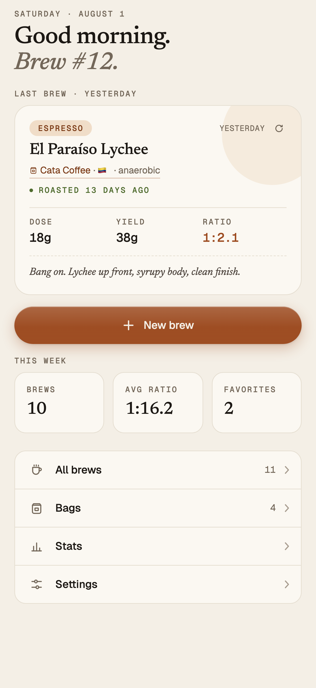
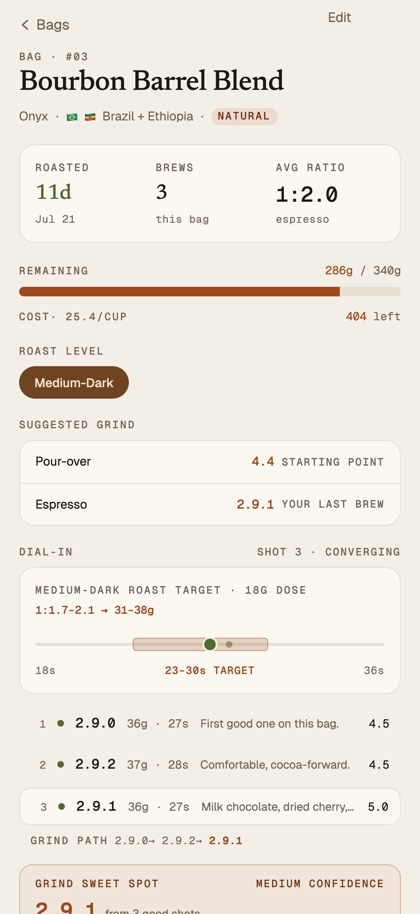
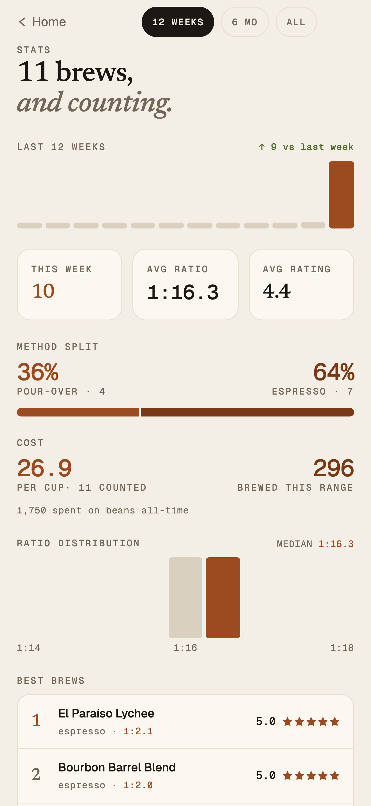

# Coffee Brew Log

Personal coffee brew log for espresso and pour-over — a local-first SvelteKit PWA with cloud sync, an iOS app shell, and one-tap publishing to a companion blog.

[](https://github.com/Mark6611/coffee-brew-log/actions/workflows/ci.yml)
[](https://apps.apple.com/app/id6786772685)

<p>
  
  
  
</p>

- **Local-first:** every brew is stored on-device in IndexedDB (Dexie), so the app works fully offline.
- **Sync (web):** signed-in devices sync through Supabase (magic-link auth, last-write-wins).
- **iOS:** the same codebase ships as a native app via Capacitor — [live on the App Store](https://apps.apple.com/app/id6786772685). The iOS build is local-first with iCloud (CloudKit) sync — no login, no Supabase on device.
- **Blog:** selected brews publish to [Brew Sheet](https://github.com/Mark6611/html-brew), a static Astro blog that reads from the shared Supabase backend.

## Where the main code lives

**`src/` is the app.** Everything else at the root is packaging (iOS shell, deploy config, App Store tooling).

```text
src/
├── routes/              Pages (SvelteKit file-based routing)
│   ├── +page.svelte       Home / today view
│   ├── brews/             Brew list, detail, and "log a new brew" form
│   ├── bags/              Coffee-bag inventory (list, detail, new)
│   ├── stats/             Brewing stats and trends
│   ├── settings/          Settings, export, account
│   └── auth/              Magic-link sign-in + callback
└── lib/
    ├── db/              ⭐ Data layer — START HERE
    │   ├── repository.ts   The ONLY database entry point. Components never
    │   │                   touch Dexie/Supabase directly; they call this.
    │   ├── database.ts     Dexie (IndexedDB) schema
    │   └── types.ts        Brew, Bag, and related record types
    ├── brews/           Brew domain logic (ratio/extraction math, dial-in
    │                    suggestions, grind handling, repeat-brew prefill)
    ├── bags/            Bag domain logic (remaining weight, roast levels)
    ├── stats/           Stats aggregation for the trends page
    ├── scale/           BLE smart-scale protocol + live shot tracking
    ├── origin/          Coffee-origin lookup/normalization
    ├── photo/           Client-side photo resizing
    ├── blog/            Publish-to-blog config
    ├── components/      Reusable UI components (cards, pickers, badges…)
    ├── auth.svelte.ts   Supabase auth state
    └── native.ts        Capacitor/native-shell integration
```

Supporting directories:

| Path            | What it is                                                                                                                     |
| --------------- | ------------------------------------------------------------------------------------------------------------------------------ |
| `ios/`          | Capacitor-generated Xcode project (the iOS app shell)                                                                          |
| `supabase/`     | SQL migrations for the sync backend                                                                                            |
| `scripts/`      | Tooling: App Store Connect automation (`asc-*.mjs`), CSV/JSON export, icon + screenshot generation                             |
| `static/`       | PWA manifest, icons, service-worker assets                                                                                     |
| `docs/`, `*.md` | [DEPLOYMENT.md](DEPLOYMENT.md), [APP-STORE-SUBMISSION.md](APP-STORE-SUBMISSION.md), [UAT-NATIVE.md](UAT-NATIVE.md), milestones |

## Architecture

Local-first, with the storage boundary as the load-bearing wall:

```text
UI (SvelteKit routes + components)
        │  every read/write
        ▼
src/lib/db/repository.ts        ← the single data boundary
        ▼
Dexie / IndexedDB               ← on-device source of truth; app works fully offline
        │
        ├─ web build:  background sync to Supabase (magic-link auth, last-write-wins)
        ├─ iOS build:  iCloud (CloudKit) sync via the Capacitor shell — no account, no Supabase
        └─ publish:    selected brews → Brew Sheet blog (Astro), read from the shared Supabase backend
```

- Components never import Dexie or Supabase directly — they call `repository.ts`. That boundary is what lets the two builds swap sync backends (Supabase vs iCloud) without touching UI code.
- Computed values (brew ratio, extraction) are derived at read time, never stored, so there is nothing to migrate when a formula changes.
- One codebase, two shells: the PWA deploys to Vercel with a service worker; `npm run ios` produces the Capacitor/WKWebView build that ships to the App Store.

## Data model conventions

- `grindSetting` is a **string**, not a number — grinders use different scales.
- `brewedAt` is stored as an **ISO string**, not a `Date`.
- Computed values (brew ratio, extraction) are derived at read time, never stored.
- All DB access goes through `src/lib/db/repository.ts` — keep that boundary.

More conventions in [CLAUDE.md](CLAUDE.md).

## Develop

```sh
npm install
cp .env.example .env   # Supabase URL + anon key (sync is optional in dev)
npm run dev
```

| Command                   | Purpose                                   |
| ------------------------- | ----------------------------------------- |
| `npm run dev`             | Dev server                                |
| `npm test`                | Unit tests (Vitest)                       |
| `npm run check`           | Type-check (svelte-check)                 |
| `npm run lint` / `format` | Prettier + ESLint                         |
| `npm run build`           | Production web build (deployed on Vercel) |
| `npm run ios`             | Capacitor build → sync → open Xcode       |
| `npm run export`          | Local CSV/JSON backup of the database     |

## Engineering practice

Everything below is verifiable in this repo:

- **222 unit tests in 16 Vitest files** (`npm test`) covering the domain logic: brew/ratio math, dial-in and grind calibration, stats and cost aggregation, BLE scale protocol parsing, sync row mapping, origin resolution, photo resizing.
- **CI on every push and PR** ([ci.yml](.github/workflows/ci.yml)): typecheck (svelte-check) → unit tests → production build → built-bundle CSS gate.
- **Built-output CSS gate** ([`scripts/verify-bundle-css.mjs`](scripts/verify-bundle-css.mjs)): scans the _emitted_ CSS bundle — not the source — for three bug classes that previously reached users: missing unprefixed `backdrop-filter`, `color-mix()` outside an `@supports` guard, and media-query range syntax unsupported below Safari 16.4.
- **One-command gate:** `npm run verify` = typecheck → tests → lint → build → bundle-CSS gate.
- **Scripted App Store releases** (`scripts/asc-*.mjs`): `asc-preflight.mjs` validates App Store Connect prerequisites _before_ archiving, then `asc-wait-build`, `asc-screenshots`, and `asc-submit` handle build polling, screenshot upload, and submission.
- **Push gate for parallel work** ([`scripts/sync-check.mjs`](scripts/sync-check.mjs)): reports divergence from `origin/main` — and which incoming files the current branch also touches — before a push or a long verify run.
- **Dynamic Type on iOS:** user text-size settings scale the app inside the WKWebView shell via `font: -apple-system-body` on `:root` ([src/routes/layout.css](src/routes/layout.css)).

## Related projects

- [html-brew](https://github.com/Mark6611/html-brew) — Brew Sheet, the public Astro blog this app publishes to.
- [chawan](https://github.com/Mark6611/chawan) — the matcha-session sibling of this app; local-only, App Store review in progress.
- [buffy](https://github.com/Mark6611/buffy) — BuffUp, the workout-tracker sibling (SvelteKit + Capacitor), [live on the App Store](https://apps.apple.com/app/id6785999682).
